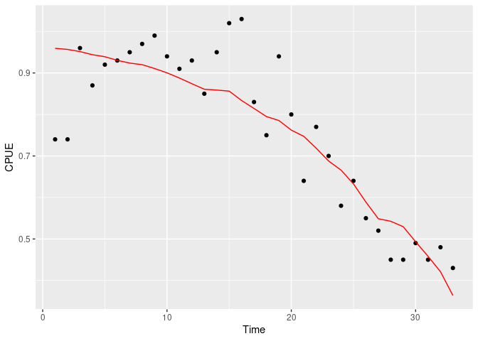
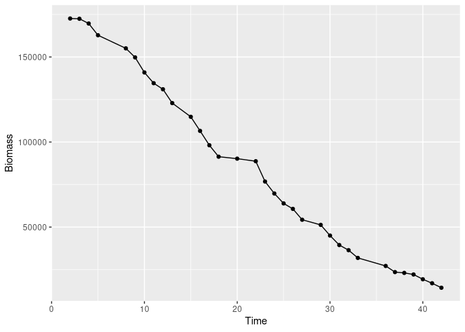

<!-- README.md is generated from README.Rmd. Please edit that file -->

# csdm

<!-- badges: start -->

[](https://opensource.org/licenses/MIT/)
[](https://github.com/pedersen-fisheries-lab/csdm/actions)
[](https://app.codecov.io/gh/pedersen-fisheries-lab/csdm)
[](https://CRAN.R-project.org/package=csdm/)
[](https://github.com/pedersen-fisheries-lab/csdm/releases/latest)
[](https://CRAN.R-project.org/package=csdm)
[](https://github.com/pedersen-fisheries-lab/csdm/blob/main/DESCRIPTION)
<!-- badges: end -->

<!-- badges: end -->

The goal of csdm is to implement a bayesian catch saturation-depletion
model.

## Installation

You can install the development version from
[GitHub](https://github.com/) with:

``` r
# install.packages("devtools")
devtools::install_github("pedersen-fisheries-lab/csdm")
```

## Example

1.  Let’s use the data provided in the package and taken from Delury’s
    population estimator data.

``` r
library(csdm)
delury <- csdm::delury_lobster
```

2.  Let’s run the model.

``` r
delury_model <- csdm(catch = cpue,
                     effort = traps,
                     biomass = ~1,
                     q = ~1,
                     s = ~1,
                     data = delury,
                     prior = list(B0_logmean_prior_sd = log(1000),
                                  B0_group_prior_logsd = log(100)),
                     upper =  c(B0 = 1e10, q = 1e-3, s = 100),
                     chains = 4,
                     iter = 1000)
#> 
#> SAMPLING FOR MODEL 'nonlinear_cpue_grouped' NOW (CHAIN 1).
#> Chain 1: 
#> Chain 1: Gradient evaluation took 0.000409 seconds
#> Chain 1: 1000 transitions using 10 leapfrog steps per transition would take 4.09 seconds.
#> Chain 1: Adjust your expectations accordingly!
#> Chain 1: 
#> Chain 1: 
#> Chain 1: Iteration:   1 / 1000 [  0%]  (Warmup)
#> Chain 1: Iteration: 100 / 1000 [ 10%]  (Warmup)
#> Chain 1: Iteration: 200 / 1000 [ 20%]  (Warmup)
#> Chain 1: Iteration: 300 / 1000 [ 30%]  (Warmup)
#> Chain 1: Iteration: 400 / 1000 [ 40%]  (Warmup)
#> Chain 1: Iteration: 500 / 1000 [ 50%]  (Warmup)
#> Chain 1: Iteration: 501 / 1000 [ 50%]  (Sampling)
#> Chain 1: Iteration: 600 / 1000 [ 60%]  (Sampling)
#> Chain 1: Iteration: 700 / 1000 [ 70%]  (Sampling)
#> Chain 1: Iteration: 800 / 1000 [ 80%]  (Sampling)
#> Chain 1: Iteration: 900 / 1000 [ 90%]  (Sampling)
#> Chain 1: Iteration: 1000 / 1000 [100%]  (Sampling)
#> Chain 1: 
#> Chain 1:  Elapsed Time: 12.4691 seconds (Warm-up)
#> Chain 1:                5.5825 seconds (Sampling)
#> Chain 1:                18.0516 seconds (Total)
#> Chain 1: 
#> 
#> SAMPLING FOR MODEL 'nonlinear_cpue_grouped' NOW (CHAIN 2).
#> Chain 2: 
#> Chain 2: Gradient evaluation took 0.000447 seconds
#> Chain 2: 1000 transitions using 10 leapfrog steps per transition would take 4.47 seconds.
#> Chain 2: Adjust your expectations accordingly!
#> Chain 2: 
#> Chain 2: 
#> Chain 2: Iteration:   1 / 1000 [  0%]  (Warmup)
#> Chain 2: Iteration: 100 / 1000 [ 10%]  (Warmup)
#> Chain 2: Iteration: 200 / 1000 [ 20%]  (Warmup)
#> Chain 2: Iteration: 300 / 1000 [ 30%]  (Warmup)
#> Chain 2: Iteration: 400 / 1000 [ 40%]  (Warmup)
#> Chain 2: Iteration: 500 / 1000 [ 50%]  (Warmup)
#> Chain 2: Iteration: 501 / 1000 [ 50%]  (Sampling)
#> Chain 2: Iteration: 600 / 1000 [ 60%]  (Sampling)
#> Chain 2: Iteration: 700 / 1000 [ 70%]  (Sampling)
#> Chain 2: Iteration: 800 / 1000 [ 80%]  (Sampling)
#> Chain 2: Iteration: 900 / 1000 [ 90%]  (Sampling)
#> Chain 2: Iteration: 1000 / 1000 [100%]  (Sampling)
#> Chain 2: 
#> Chain 2:  Elapsed Time: 10.9949 seconds (Warm-up)
#> Chain 2:                5.84223 seconds (Sampling)
#> Chain 2:                16.8371 seconds (Total)
#> Chain 2: 
#> 
#> SAMPLING FOR MODEL 'nonlinear_cpue_grouped' NOW (CHAIN 3).
#> Chain 3: 
#> Chain 3: Gradient evaluation took 0.000437 seconds
#> Chain 3: 1000 transitions using 10 leapfrog steps per transition would take 4.37 seconds.
#> Chain 3: Adjust your expectations accordingly!
#> Chain 3: 
#> Chain 3: 
#> Chain 3: Iteration:   1 / 1000 [  0%]  (Warmup)
#> Chain 3: Iteration: 100 / 1000 [ 10%]  (Warmup)
#> Chain 3: Iteration: 200 / 1000 [ 20%]  (Warmup)
#> Chain 3: Iteration: 300 / 1000 [ 30%]  (Warmup)
#> Chain 3: Iteration: 400 / 1000 [ 40%]  (Warmup)
#> Chain 3: Iteration: 500 / 1000 [ 50%]  (Warmup)
#> Chain 3: Iteration: 501 / 1000 [ 50%]  (Sampling)
#> Chain 3: Iteration: 600 / 1000 [ 60%]  (Sampling)
#> Chain 3: Iteration: 700 / 1000 [ 70%]  (Sampling)
#> Chain 3: Iteration: 800 / 1000 [ 80%]  (Sampling)
#> Chain 3: Iteration: 900 / 1000 [ 90%]  (Sampling)
#> Chain 3: Iteration: 1000 / 1000 [100%]  (Sampling)
#> Chain 3: 
#> Chain 3:  Elapsed Time: 13.4431 seconds (Warm-up)
#> Chain 3:                7.40298 seconds (Sampling)
#> Chain 3:                20.8461 seconds (Total)
#> Chain 3: 
#> 
#> SAMPLING FOR MODEL 'nonlinear_cpue_grouped' NOW (CHAIN 4).
#> Chain 4: 
#> Chain 4: Gradient evaluation took 0.000479 seconds
#> Chain 4: 1000 transitions using 10 leapfrog steps per transition would take 4.79 seconds.
#> Chain 4: Adjust your expectations accordingly!
#> Chain 4: 
#> Chain 4: 
#> Chain 4: Iteration:   1 / 1000 [  0%]  (Warmup)
#> Chain 4: Iteration: 100 / 1000 [ 10%]  (Warmup)
#> Chain 4: Iteration: 200 / 1000 [ 20%]  (Warmup)
#> Chain 4: Iteration: 300 / 1000 [ 30%]  (Warmup)
#> Chain 4: Iteration: 400 / 1000 [ 40%]  (Warmup)
#> Chain 4: Iteration: 500 / 1000 [ 50%]  (Warmup)
#> Chain 4: Iteration: 501 / 1000 [ 50%]  (Sampling)
#> Chain 4: Iteration: 600 / 1000 [ 60%]  (Sampling)
#> Chain 4: Iteration: 700 / 1000 [ 70%]  (Sampling)
#> Chain 4: Iteration: 800 / 1000 [ 80%]  (Sampling)
#> Chain 4: Iteration: 900 / 1000 [ 90%]  (Sampling)
#> Chain 4: Iteration: 1000 / 1000 [100%]  (Sampling)
#> Chain 4: 
#> Chain 4:  Elapsed Time: 13.5012 seconds (Warm-up)
#> Chain 4:                8.13972 seconds (Sampling)
#> Chain 4:                21.641 seconds (Total)
#> Chain 4:
#> Warning: There were 103 divergent transitions after warmup. See
#> https://mc-stan.org/misc/warnings.html#divergent-transitions-after-warmup
#> to find out why this is a problem and how to eliminate them.
#> Warning: Examine the pairs() plot to diagnose sampling problems
#> Warning: Bulk Effective Samples Size (ESS) is too low, indicating posterior means and medians may be unreliable.
#> Running the chains for more iterations may help. See
#> https://mc-stan.org/misc/warnings.html#bulk-ess
#> Warning: Tail Effective Samples Size (ESS) is too low, indicating posterior variances and tail quantiles may be unreliable.
#> Running the chains for more iterations may help. See
#> https://mc-stan.org/misc/warnings.html#tail-ess
```

3.  You can extract the fit for cpue, as well as the biomass estimate.

``` r
get_cpue_fit(delury_model)
#> Warning: `gather_()` was deprecated in tidyr 1.2.0.
#> Please use `gather()` instead.
#> This warning is displayed once every 8 hours.
#> Call `lifecycle::last_lifecycle_warnings()` to see where this warning was generated.
#> # A tibble: 33 × 14
#>        t cpue_fit .lower .upper .width .point .inter…¹  date catch…² traps  cpue
#>    <int>    <dbl>  <dbl>  <dbl>  <dbl> <chr>  <chr>    <int>   <int> <int> <dbl>
#>  1     1    0.958  0.913  1.02    0.95 median qi           2     147   200  0.74
#>  2     2    0.955  0.911  1.02    0.95 median qi           3    2796  3780  0.74
#>  3     3    0.950  0.907  1.01    0.95 median qi           4    6888  7174  0.96
#>  4     4    0.943  0.902  0.996   0.95 median qi           5    7723  8850  0.87
#>  5     5    0.939  0.898  0.989   0.95 median qi           8    5330  5793  0.92
#>  6     6    0.930  0.891  0.974   0.95 median qi           9    8839  9504  0.93
#>  7     7    0.924  0.885  0.965   0.95 median qi          10    6324  6655  0.95
#>  8     8    0.920  0.881  0.961   0.95 median qi          11    3569  3685  0.97
#>  9     9    0.911  0.872  0.950   0.95 median qi          12    8120  8202  0.99
#> 10    10    0.901  0.863  0.937   0.95 median qi          13    8084  8585  0.94
#> # … with 23 more rows, 3 more variables: traps_cum <int>, cpue_l <dbl>,
#> #   cpue_l10 <dbl>, and abbreviated variable names ¹​.interval, ²​catch_pounds
```

``` r
get_biomass(delury_model)
#> # A tibble: 33 × 13
#>    biomass .lower .upper .width .point .inte…¹  date catch…² traps  cpue traps…³
#>      <dbl>  <dbl>  <dbl>  <dbl> <chr>  <chr>   <int>   <int> <int> <dbl>   <int>
#>  1 172621. 1.65e5 1.98e5   0.95 median qi          2     147   200  0.74     200
#>  2 172473. 1.65e5 1.97e5   0.95 median qi          3    2796  3780  0.74    3980
#>  3 169676. 1.62e5 1.95e5   0.95 median qi          4    6888  7174  0.96   11154
#>  4 162788. 1.55e5 1.88e5   0.95 median qi          5    7723  8850  0.87   20004
#>  5 155089. 1.47e5 1.80e5   0.95 median qi          8    5330  5793  0.92   25797
#>  6 149759. 1.42e5 1.75e5   0.95 median qi          9    8839  9504  0.93   35301
#>  7 140921. 1.33e5 1.66e5   0.95 median qi         10    6324  6655  0.95   41956
#>  8 134598. 1.27e5 1.60e5   0.95 median qi         11    3569  3685  0.97   45641
#>  9 131024. 1.23e5 1.56e5   0.95 median qi         12    8120  8202  0.99   53843
#> 10 122904. 1.15e5 1.48e5   0.95 median qi         13    8084  8585  0.94   62428
#> # … with 23 more rows, 2 more variables: cpue_l <dbl>, cpue_l10 <dbl>, and
#> #   abbreviated variable names ¹​.interval, ²​catch_pounds, ³​traps_cum
```

4.  You can also get default plots for cpue and biomass.

``` r
plot(delury_model)
```



``` r
plot_biomass(delury_model)
```


